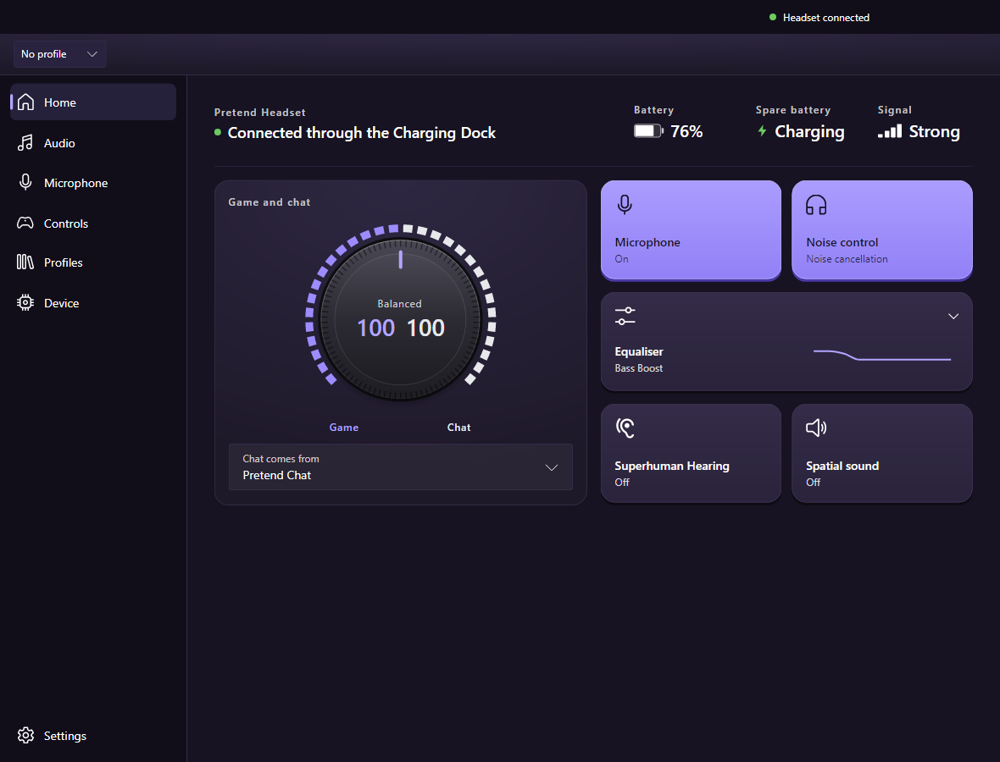
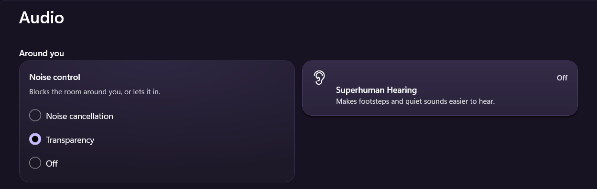
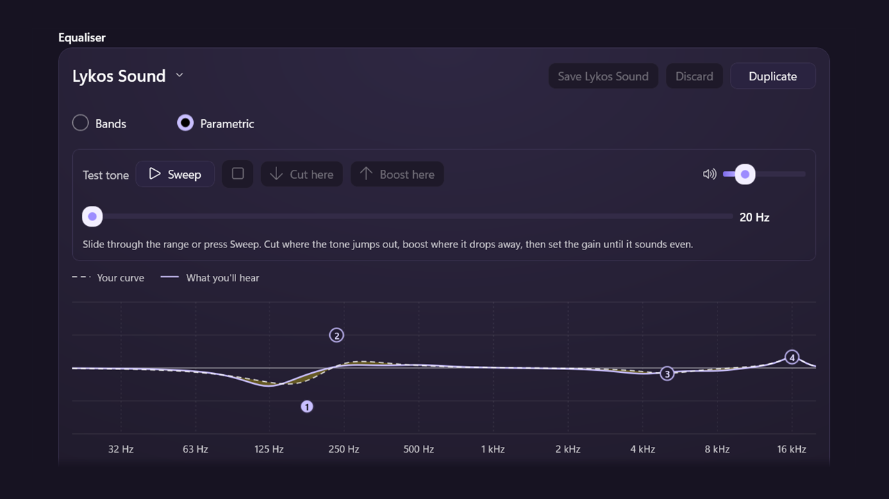
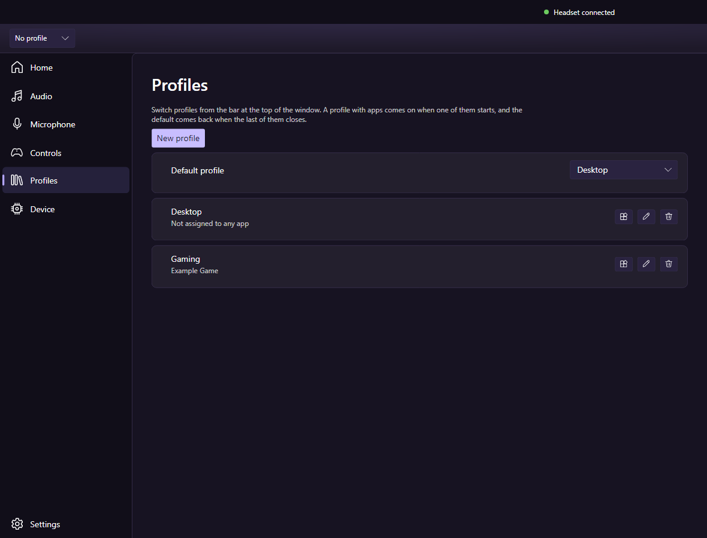
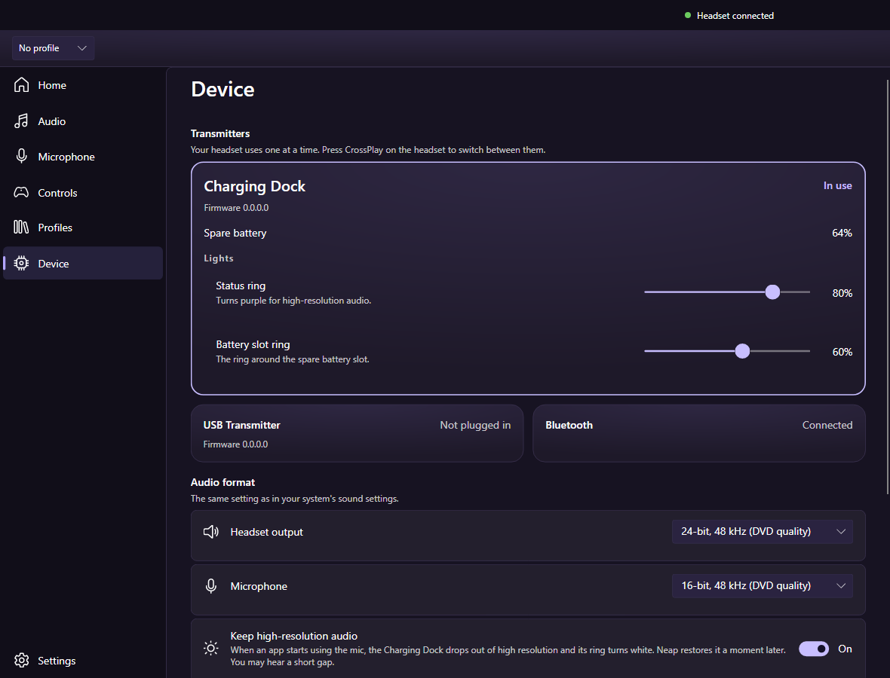

# Neap

Quiet control for the Turtle Beach Stealth Pro II on Windows, in place of
Swarm II. No driver, no Turtle Beach software, no admin rights.

**[Download the latest release](https://github.com/lykosapps/Neap/releases/latest)**
· Windows 10 version 2004 or later, 64-bit

**For the Stealth Pro II only, for now.** Tested on the Xbox edition. The
PlayStation edition should work but hasn't been tried, so reports are
welcome. The Stealth 600 Gen 3, 700 Gen 3, 500 and Atlas Air share its
platform, and [the probe](#the-probe) is how a new headset's settings get
mapped, so support for them could follow with help from someone who owns
one.

Not affiliated with or endorsed by Turtle Beach. Turtle Beach, Stealth Pro II
and Swarm II are trademarks of Turtle Beach Corporation.

## What it does

### A game and chat mix, with nothing to install

Pick the apps that carry chat, such as Discord or Teams, and Neap turns them
against everything else. No virtual audio cable, driver or reboot, and it
works on the Xbox edition, where Swarm II's mix isn't officially supported.

Move it with the headset's chat wheel, the dial on Home, or the keyboard
from inside a game: Ctrl + Alt + Page Down, Page Up and Home, all
rebindable.



### Transparency

Choose noise cancellation, transparency or off. The headset has no
transparency mode of its own; transparency is noise cancellation at zero,
which lets the room in. The Mode button steps through all three while Neap
is running.



### An equaliser you can tune by ear

- **Parametric equaliser** for game audio: up to four adjustments, fitted to
  the headset's ten bands, with a plot of what you'll actually hear.
- **Test tone.** Find a frequency that stands out, then cut or boost it on
  the spot.
- **Presets stored on the headset**, for game and microphone, so they also
  appear in the phone app and survive uninstalling everything.



### Profiles for each game

Save your whole setup under a name, from noise control to both equalisers.
Give a profile one or more games, and it comes on when one of them starts,
then goes back to your default when it closes.



### The Charging Dock

See the spare battery's charge while the headset is docked, set the
brightness of both lights, and choose the audio format. Neap can also put
the dock back into high-resolution audio after an app has used the
microphone.



### Everything else

- **Clear status.** Connected, no sound, switched off or out of range, each
  with what still works and the one thing to do.
- **Catches the wrong device.** When Windows sends sound or the microphone
  somewhere the headset isn't listening, Neap names the right one.
- **Settings Swarm II's desktop app doesn't have:** wake on motion and voice
  prompt volume.
- **Every other setting** the headset has: microphone, noise gate,
  Superhuman Hearing, spatial sound, buttons and dial, lighting and power.
- **Runs from the notification area**, with the mix and chat wheel still
  working, and can start with Windows.
- **Works from the keyboard and with screen readers**, in light, dark and
  high contrast themes.

The [changelog](CHANGELOG.md) has the full list, and what's not included.

## Install

1. From the [latest release](https://github.com/lykosapps/Neap/releases/latest),
   download `Neap-<version>-win-x64.zip`.
2. Unzip it to a folder of its own, such as `C:\Users\<you>\Apps\Neap`.
3. Run `Neap.exe`.
4. Close Swarm II and remove the Waves audio driver, as described in
   [Alongside Swarm II](#alongside-swarm-ii).

The download is not signed yet, so the first time, Windows says it protected
your PC. Choose **More info**, then **Run anyway**.

It needs nothing else: no .NET runtime, no Windows App SDK, no driver. That
makes it about 260 MB on disk.

**To update,** close Neap from the notification area, replace the contents
of its folder with the new release, and run it again. Settings are kept.

**To remove it,** turn off **Start with Windows** in its settings if you
turned it on, close it from the notification area, and delete its folder
and `%LOCALAPPDATA%\Neap`, where it keeps its settings and log.

**To check a download,** each release is built on GitHub from the tagged
commit and has a `.sha256` file beside the zip. Compare it with:

```
Get-FileHash Neap-<version>-win-x64.zip
```

## Alongside Swarm II

1. **Keep Swarm II, for firmware updates and pairing.** Neap deliberately
   does neither.
2. **Make sure Swarm II isn't running in the background.** The two apps
   fight over the headset when both are open. In Swarm II: Settings (the
   cog, bottom left) → App Settings → turn off **Autostart Swarm II**, then
   close it, including from the notification area. Open it only for a
   firmware update, and close it again afterwards.
3. **Remove the Waves audio driver.** Neap's mix doesn't need it. In
   Windows Settings → Apps, uninstall **Turtle Beach Audio Driver** by Waves
   Audio Ltd, and don't reinstall it from Swarm II's driver menu.

## Status

Working and in daily use, but young. Everything has been exercised on one
headset on one Windows machine. There is no installer yet, and it was
written with AI assistance.

Found a problem? In **Settings → Diagnostics**, record while it happens,
then choose **Report on GitHub**. You can also
[open an issue](https://github.com/lykosapps/Neap/issues) directly. Have
another Turtle Beach headset? [Help support it](docs/MAPPING.md).
For a security problem, see [SECURITY.md](SECURITY.md).

## For developers

- [CONTRIBUTING.md](CONTRIBUTING.md): building, testing, and the checks
  that need a headset
- [FINDINGS.md](FINDINGS.md): the headset's protocol and behaviour, as
  measured
- [ARCHITECTURE.md](ARCHITECTURE.md): the two halves, and why the audio one
  is the awkward part
- [BACKLOG.md](BACKLOG.md): bugs, features and work still to do

### Building it

```
cd src/Neap.App
dotnet publish -c Release -r win-x64
```

Then run `Neap.exe` from the `publish` folder. You need the .NET 10 SDK to
build, but not to run the result.

### The probe

`Neap.Probe` is a console harness that talks to the headset without a
UI. It is how the protocol was worked out and it is still the fastest way to
see what the hardware is actually saying:

```
dotnet build src/Neap.Probe -c Release
src/Neap.Probe/bin/Release/net10.0-windows/Neap.Probe.exe read
```

`devices`, `read`, `named`, `registry`, `presets`, `transmitters`, `json`,
`watch`, `diff`, `audio` and `route` are the ones worth knowing — `route`
says where Windows sends sound and takes the microphone from, for each of its
roles, and which of the headset's devices is carrying sound right now.

A few more matter when something is not behaving:

- `raw [seconds] [usage page]` prints every report as it arrives, decoded or
  not, and does not require the device to answer a command first. It listens
  for what the device pushes and asks for what it answers, and labels which
  path saw each report — a path that cannot see anything says so rather than
  going quiet. Usage page `000c` is where the volume wheel pushes its clicks;
  the chat wheel reports on the settings channel, through whichever
  transmitter is carrying the headset's controls.
- `who` asks every transmitter plugged in, separately, which one is carrying
  the headset's controls. With two plugged in, the answer is not always the
  one playing the sound.
- `hear <output>` plays a soft beep on one output every three seconds and
  prints each of the headset's microphones' levels, second by second. It is
  for what a default device cannot tell you: whether a device reaches the
  headset at all, and which microphone actually hears you.
- `decode <file.pcap>` reads a USBPcap recording of Swarm II driving the
  headset and prints every command and reply, naming the ones in the
  registry. This is how anything new gets learned — the registry was built
  by watching the vendor's app. Capture with `tools/capture.ps1`.

### Safety

Read-first. The client writes nothing unless it is made with writes allowed,
and even then it sends only settings in the confirmed registry, within their
confirmed ranges. The one write known to cause harm, a transmitter slot's
base address, is refused outright. Nothing touches the firmware update path,
which is signed and encrypted.

One warning worth repeating from the findings: a transmitter will answer
questions about a headset it can no longer reach, with stale values, and the
chip vendor's own firmware commands reach only the USB device you are plugged
into, never the headset behind it. Confirm which device answered before
trusting a result.

## Licence

Copyright (C) 2026 lykosapps

This program is free software: you can redistribute it and/or modify it
under the terms of the GNU General Public License as published by the Free
Software Foundation, either version 3 of the License, or (at your option)
any later version. It is distributed in the hope that it will be useful, but
WITHOUT ANY WARRANTY; without even the implied warranty of MERCHANTABILITY or
FITNESS FOR A PARTICULAR PURPOSE. See [LICENSE](LICENSE) for the full text.

The third-party components it uses keep their own licences; see
[THIRD-PARTY-NOTICES.txt](THIRD-PARTY-NOTICES.txt).
