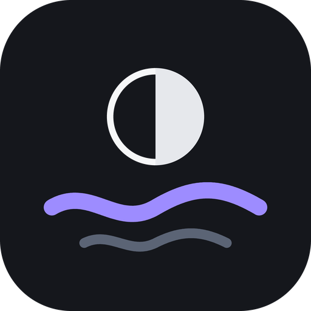

# Neap

Quiet control for the Turtle Beach Stealth Pro II on Windows. A third-party
app, written to replace Swarm II.

Not affiliated with or endorsed by Turtle Beach. Turtle Beach, Stealth Pro II
and Swarm II are trademarks of Turtle Beach Corporation.

- [FINDINGS.md](FINDINGS.md) — the headset's protocol and behaviour, as measured
- [ARCHITECTURE.md](ARCHITECTURE.md) — the two halves, and why the audio one
  is the awkward part
- [CONTRIBUTING.md](CONTRIBUTING.md) — building, testing, and the checks
  that need a headset
- [SECURITY.md](SECURITY.md) — reporting a security problem
- [CHANGELOG.md](CHANGELOG.md) — what Neap does, how it differs from Swarm II,
  and what changed
- [BACKLOG.md](BACKLOG.md) — bugs, features and work still to do

## What it does

**The headset, with nothing installed.** Every setting it exposes, over its
own HID protocol: noise cancellation, both ten-band equalisers, microphone,
noise gate, Superhuman Hearing, button and dial assignment, transmitter
lighting, battery, power, wake on motion, voice prompts. No driver, no
Turtle Beach software, no admin rights. Two of those — wake on motion and
voice prompt volume — are not in Swarm II's desktop app at all.

**Transparency, which the headset does not offer.** Noise control has three
modes: noise cancellation, transparency and off. Transparency is noise
cancellation at zero, which lets the room through. The Mode button can step
through all three while Neap is running.

**A game and chat mix that needs no setup.** The transmitter gives Windows a
single stereo output, so the headset cannot split game from chat on a PC. It
has to be done on the PC, and every other way of doing it asks you to install
a virtual audio cable, or a driver, or to own a spare output device. This one
asks a single question — which application carries your chat — and mixes that
application's audio against everything else. Nothing to install, nothing to
reboot.

Move it with the headset's chat wheel, with the dial on Home, or with the keyboard
from inside a game: Ctrl + Alt + Page Down, Page Up and Home, all rebindable.

**Equaliser presets stored on the headset**, for both the game and microphone
banks. Names and curves come straight off the device, so nothing is cached
and nothing goes stale. Browse them, switch between them, save your own into
one of five custom slots per bank, and delete ones you no longer want.
Because they live on the headset, they also appear in the phone app and
survive uninstalling everything.

**The transmitters.** The headset pairs with up to four and reports each
slot: which piece of hardware, its firmware, its address, and which one it is
using. Each transmitter's light brightnesses live in its slot, readable and
writable.

**It says what is actually happening.** Connected, no sound, settings out of
reach, switched off, out of range — each is its own state with its own words,
worked out from what the headset and Windows report rather than assumed, and
each says what still works and the one thing to do. When Windows is sending
sound or taking the microphone from a device the headset is not listening to,
it names the right one. The Charging Dock, the USB Transmitter and the
headset's own USB-C cable all work, alone or together.

**It stays out of the way.** Closing the window keeps the mix and the chat
wheel running from the notification area, and it can start with Windows
without ever opening a window.

## Running it

**Windows 10 version 2004 (build 19041) or later, 64-bit.** Nothing else.
No .NET runtime, no Windows App SDK, no driver — it publishes self-contained,
which costs about 260 MB on disk and saves a stranger from installing
anything.

There are no downloadable builds yet. To build one:

```
cd src/Neap.App
dotnet publish -c Release -r win-x64
```

Then run `Neap.exe` from the `publish` folder. You need the .NET 10
SDK to build, but not to run the result.

## Living with Swarm II

The headset presents itself to Windows as an ordinary USB audio device and an
ordinary HID device. Both work with no Turtle Beach software at all, and this
app talks to the HID device directly — confirmed by running the whole thing
with the Waves driver uninstalled.

Even so, it is worth keeping Swarm installed, set up like this:

**1. Keep Swarm II, for firmware updates.** This app deliberately does not
touch firmware or pair transmitters. Those are the one thing worth leaving to
the vendor's own tool.

**2. Stop Swarm launching at startup.** In Swarm: Settings (the cog,
bottom-left) → App Settings → turn off **Autostart Swarm II**. Swarm polls
the headset thousands of times a second and takes the replies, so the two
fight over the connection whenever both are open. This app says so plainly
rather than appearing broken.

**3. Do not install the Waves audio driver.** Swarm does not add it unless
you click "Install Waves Audio Driver" in its driver menu, so simply never
click it. This app's mix does not use it, and on the Xbox edition Waves is
the component whose chat mix is broken in the first place.

If an earlier setup already added it, it appears in Windows Settings → Apps
as **"Turtle Beach Audio Driver" by Waves Audio Ltd**. Removing it is
optional — the mix here works either way.

## The probe

`Neap.Probe` is a console harness that talks to the headset without a
UI. It is how the protocol was worked out and it is still the fastest way to
see what the hardware is actually saying:

```
dotnet build src/Neap.Probe -c Release
src/Neap.Probe/bin/Release/net10.0-windows/Neap.Probe.exe read
```

`devices`, `read`, `named`, `registry`, `presets`, `transmitters`, `json`,
`watch`, `diff`, `audio` and `route` are the ones worth knowing — `route`
says where Windows sends sound and takes the microphone from, for each of its
roles, and which of the headset's devices is carrying sound right now.

A few more matter when something is not behaving:

- `raw [seconds] [usage page]` prints every report as it arrives, decoded or
  not, and does not require the device to answer a command first. It listens
  for what the device pushes and asks for what it answers, and labels which
  path saw each report — a path that cannot see anything says so rather than
  going quiet. Usage page `000c` is where the volume wheel pushes its clicks;
  the chat wheel reports on the settings channel, through whichever
  transmitter is carrying the headset's controls.
- `who` asks every transmitter plugged in, separately, which one is carrying
  the headset's controls. With two plugged in, the answer is not always the
  one playing the sound.
- `hear <output>` plays a soft beep on one output every three seconds and
  prints each of the headset's microphones' levels, second by second. It is
  for what a default device cannot tell you: whether a device reaches the
  headset at all, and which microphone actually hears you.
- `decode <file.pcap>` reads a USBPcap recording of Swarm II driving the
  headset and prints every command and reply, naming the ones in the
  registry. This is how anything new gets learned — the registry was built
  by watching the vendor's app. Capture with `tools/capture.ps1`.

## Safety

Read-first. The client writes nothing unless it is made with writes allowed,
and even then it sends only settings in the confirmed registry, within their
confirmed ranges. The one write known to cause harm, a transmitter slot's
base address, is refused outright. Nothing touches the firmware update path,
which is signed and encrypted.

One warning worth repeating from the findings: a transmitter will answer
questions about a headset it can no longer reach, with stale values, and the
chip vendor's own firmware commands reach only the USB device you are plugged
into, never the headset behind it. Confirm which device answered before
trusting a result.

## Status

Working and in daily use, but young, and honest about which is which:

- Everything above has been exercised on real hardware, on **one** Stealth
  Pro II (Xbox edition) on **one** Windows machine. Other editions share the
  protocol and the product ids are known, but none has been tested.
- There is no installer and no signed binary. You build it yourself.
- It was written with AI assistance.

## Licence

Copyright (C) 2026 lykosapps

This program is free software: you can redistribute it and/or modify it
under the terms of the GNU General Public License as published by the Free
Software Foundation, either version 3 of the License, or (at your option)
any later version. It is distributed in the hope that it will be useful, but
WITHOUT ANY WARRANTY; without even the implied warranty of MERCHANTABILITY or
FITNESS FOR A PARTICULAR PURPOSE. See [LICENSE](LICENSE) for the full text.

The third-party components it uses keep their own licences; see
[THIRD-PARTY-NOTICES.txt](THIRD-PARTY-NOTICES.txt).
